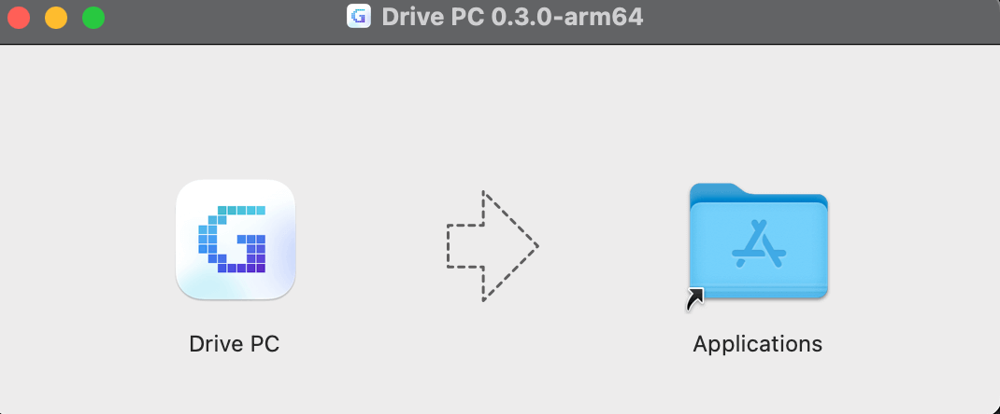
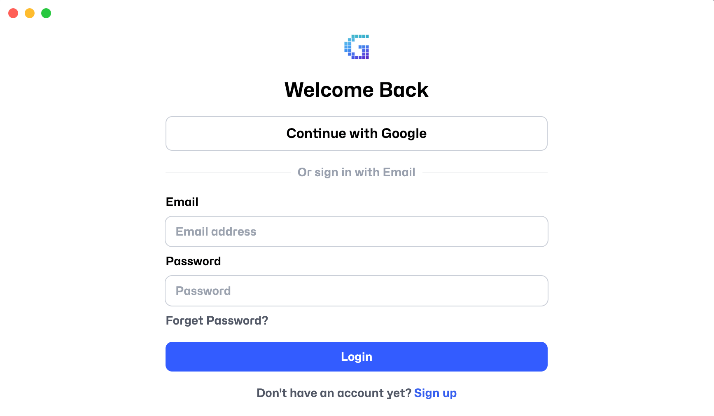
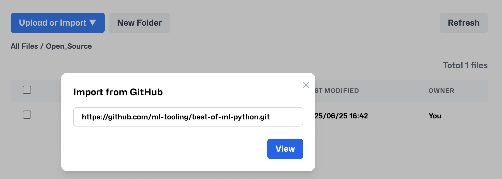
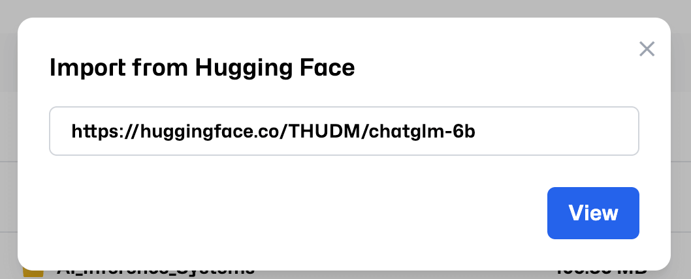
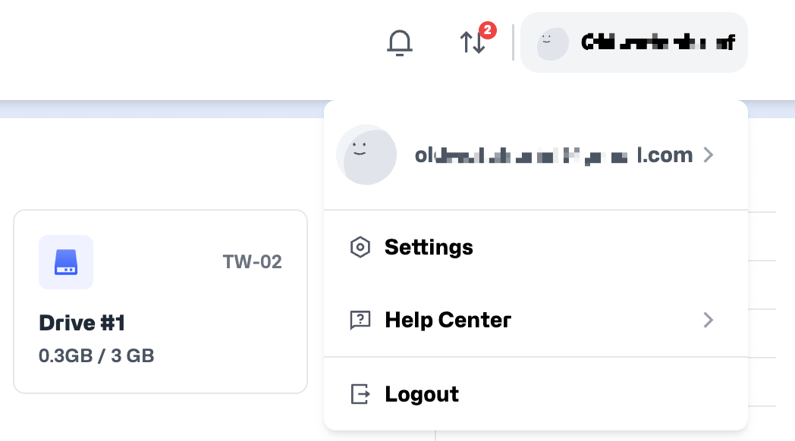

# Datadrive Desktop App

This guide will help you get started with the **Glows.ai Datadrive Desktop App**, an extension of the **Datadrive** feature from the Glows.ai web platform.
It provides a more flexible cloud data management experience, enabling you to upload, download, and sync files between your local machine and the cloud more efficiently and reliably.

With the Datadrive Desktop App, you can easily browse, edit, and manage multiple Drives, and also import resources from external sources such as GitHub and Hugging Face, supporting faster project integration, deployment, and backup for individuals or teams.

---

## Step 1: Install the Datadrive Desktop App

Visit the **Glows.ai** official website and click `Product` in the top navigation bar.
In the dropdown menu, select `Datadrive` (as shown below) to go to the download page.


Or go directly to the download page:
👉 [https://glows.ai/datadrive](https://glows.ai/datadrive)


Please download the version that matches your operating system.
Currently, Windows and Mac are supported. More operating systems will be supported in the future — stay tuned!

---

### Windows Version

1. Download the installer and double-click to run it.
2. Follow the on-screen instructions to complete the installation and launch the Datadrive Desktop App.

---

### Mac Version

1. After downloading, drag the `Drive PC` application into your `Applications` folder (as shown below).
2. Click the app in your `Dock` to launch it.



> If you see the error message
> `"Drive PC" is damaged and can't be opened...`
> open the `Terminal` and run the following command to remove the restriction:

```bash
sudo xattr -rd com.apple.quarantine "/Applications/Drive PC.app"
```


---

## Step 2: Sign In to Your Account

After launching the Datadrive Desktop App, you can log in using one of the following methods:

1. Click `Continue with Google` to sign in with your Google account.
2. Enter your **Email** and **Password**, then click `Login`.
3. If you don’t have an account yet, click `Sign up` on the login page to create one.



---

## Step 3: Manage Existing Data

After logging in, you will see the `Dashboard`, where you can monitor the used and available storage for Drives in different regions.
More management features such as `Instance` and `Snapshot` will be added in future updates.


Click the `Drive #0` menu in the bottom-left corner to expand and view all your Drives across different regions, as shown below:


After selecting a Drive, you’ll see a list of files and folders. When you select an item, four action buttons will appear at the bottom of the screen:

- **Download**: Download files/folders to your local device
- **Move**: Move items to another directory
- **Rename**: Rename files/folders
- **Delete**: Delete files/folders


---

### Download Progress

Once you start downloading, you can check the progress under the `Transfer` tab.


---

## Step 4: Upload or Import Files/Folders

Click the `Upload or Import` button to upload or import files/folders to your cloud Drive in three ways:


### 1. Upload Directly

Select `Upload File` or `Upload Folder` to browse your local device and choose the files or folders you want to upload.

---

### 2. Import from GitHub

- Click `Import from GitHub`, enter your project link, and click `View`.
- In the GitHub file explorer, select the branch or files you want to import and click `Import` to start.




---

### 3. Import from Hugging Face

- Click `Import from Hugging Face`, enter the project link, and click `View`.
- Browse and select the files or folders you want to import from the Hugging Face file explorer, then click `Import` to proceed.




---

### Upload Progress

You can check upload progress in the `Transfer` tab. Once complete, your files will appear in the selected Drive.


---

## Step 5: Other Settings

Click your avatar icon in the top-right corner and select `Settings` to configure additional options.



---

### Drive Setting

- Change language, time zone, or 12/24-hour format.
- If you encounter any issues, click `Export Log File` to generate a log for the Glows.ai team to help troubleshoot.
- If your download speed is slow or restricted by your network, you can set a `Proxy Server` and `Proxy Port` here. This allows the Datadrive Desktop App to connect via your local or corporate proxy server, improving upload and download performance.
- Click `Check for Updates` to manually check for and install the latest version.


---

### Transfer Setting

- When uploading large files or folders, enable `Prevent Sleep When Cloud Drive is Active` to prevent your computer from sleeping and interrupting the transfer.
- Use **Download Directory** to change the default location for downloaded files.
- If you need to download Hugging Face resources that require authentication, you can set your **Hugging Face Token** here.


---

## Contact Us

If you have any questions or suggestions while using the Datadrive Desktop App, feel free to reach out to us:

**Email:** [support@glows.ai](mailto:support@glows.ai)

**Line:** [https://lin.ee/fHcoDgG](https://lin.ee/fHcoDgG)
