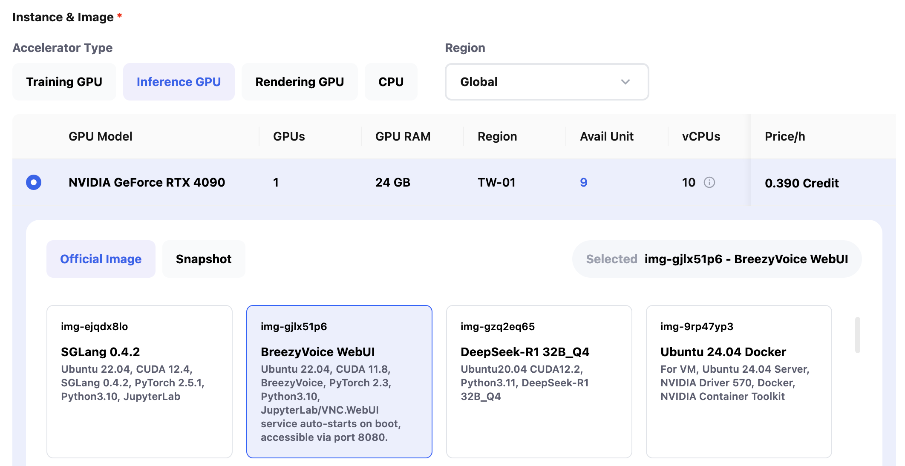
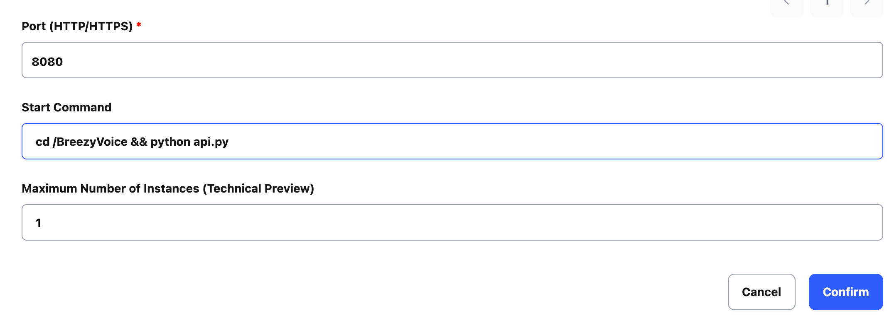

# Auto Deploy Usage

In a typical setup, using **GPU** deployment services often requires manually creating and releasing instances. For scenarios where **GPU** usage is sporadic or infrequent, this manual process can be inefficient and cumbersome.

To address this, **Glows.ai** offers the **Auto Deploy** feature. With just a one-time setup, the system will automatically manage the lifecycle of **GPU** instances on your behalf. Once configured, you will receive a fixed **service link**. When a request is sent to this link, **Glows.ai** will automatically create an instance based on your configuration, process the request, and return the result. If no new requests are received within a 5-minute window, the system will automatically release the instance—no manual action needed.

This guide will walk you through how to configure and use the **Auto Deploy** feature using the **BreezyVoice WebUI** image as an example.

---

### Step 1: Create a New Deployment Task

1. Go to the **Auto Deploy** page and click the `New Deploy` button in the top-right corner to create a new deployment task.


2. Enter a task name and description to help identify and manage your deployment later.


3. Select the required **GPU** type and runtime environment for your application. You may use a custom-created **Snapshot**, or choose from one of the system-provided images.



4. Configure the **Port** your service will listen on and the **Start Command** to launch your application. Then click `Confirm` to finish the setup.  
   In this example, the service will run on port 8080, and the executable file is api.py located in the **BreezyVoice** directory. The configuration is as follows:

```bash
Port: 8080
Start Command: cd /BreezyVoice && python api.py
```



5. Once the deployment task is created, you will receive a dedicated **service link** along with your configuration details.


---

### Step 2: Use the Auto Deploy Link

1. To use the service, simply replace your original **API** endpoint with the **Auto Deploy service link**.
   If your service includes a custom route, append the path to the end of the **service link**.
   In this example, the deployed **API** route is `/v1/audio/speech`. Here's how to make a request:

```bash
curl -X POST "https://tw-01.sgw.glows.ai:xxxxxx/v1/audio/speech" \
 -H "Authorization: Bearer sk-template" \
 -H "Content-Type: application/json" \
 --data '{
  "model": "tts-1",
  "voice": "alloy",
  "input": "How about playing basketball after school? The weather looks great today."
}' --output test_speech.wav
```


2. After the request is completed, if no additional requests are received within 5 minutes, the instance will be automatically released.  
   You can monitor the total cost and the current **Instance Status** of your deployment task from the **Auto Deploy** dashboard.  
   The instance status definitions are as follows:

- **Standby**: The deployment task is correctly configured, but no instance is currently running.
- **Idle**: The instance is either in the process of being created (upon receiving a request) or being released (after the request has been handled).
- **Running**: The instance has been successfully created and is currently handling requests. If no new request is received within 5 minutes, the instance will be automatically released.


---

## Contact Us

If you have any questions or suggestions while using **Glows.ai**, feel free to reach out to us via email or Line.

Glows.ai Email : **support@glows.ai**

Line : **https://lin.ee/fHcoDgG**
