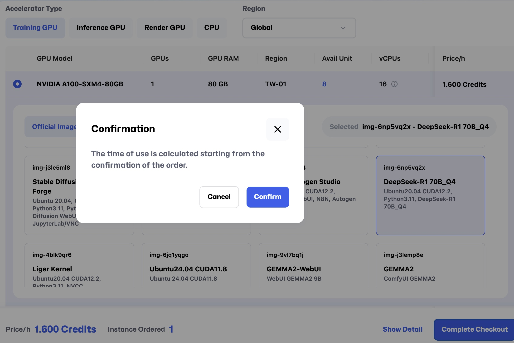

# 創建新實例

在本章節中，我們將指導您如何在 **Glows.AI** 上創建新實例。根據您的計算需求，您可以選擇 **GPU** 或 **CPU** 型號，下面是具體操作步驟。

---

## **步驟 1：選擇實例類型**

進入 **Create New** 頁面後，首先需要選擇實例類型：

- **GPU**：若您需要進行 AI 訓練、大規模數據處理或圖形密集型任務，請選擇此選項。
- **CPU**：如果您希望先使用 CPU 進行程式 debug，再切換到 GPU 進行訓練；或者如果您的任務需要強大的處理能力，但不需要使用 GPU 加速，請選擇此選項。

---

## **步驟 2：選擇 GPU 或 CPU 型號**

**GPU 型號**：

- 選擇 **GPU** 後，將顯示詳細的規格，包括：

  - **GPUs**：一個單元配置的 GPU 數量。
  - **GPU RAM**：該 GPU 的總內存。
  - **CPU 型號**：與 GPU 配對的 CPU 型號。
  - **Avail Unit**：該 GPU 型號可用的單元數量。
  - **vCPUs**：與 GPU 相關聯的虛擬 CPU 數量。
  - **RAM**：實例的總內存。
  - **Storage**：實例硬碟存儲空間。
  - **Price/h**：每小時費用（以 Credit 為單位）。

**CPU 型號**：

- 選擇 **CPU** 後，您將只看到的 CPU 相關的選項：
  - **Avail Unit**：該 CPU 型號可用的單元數量，租用疊加單元數量，其他硬體配置也會自動疊加。
  - **vCPUs**：一個單元配置的虛擬 CPU 數量。
  - **RAM**：該實例的內存。
  - **Storage**：一個單元配置的硬碟空間數量。
  - **Price/h**：每小時費用（以 Credit 為單位）。

---

## **步驟 3：選擇 Official Image 或 Snapshot**

1. 在選擇 GPU 或 CPU 型號後，您可以選擇 `Official Image` 或 `Snapshot`：

   - **Official Image**：為您的實例提供預設的配置環境。
   - **Snapshot**：當您之前創建成功的實例被保存為快照後，它們將顯示在此選項中，選擇快照可以繼續之前的工作環境和配置，節省重新設置的時間。

2. 選擇後，您將在右側看到所選項目的資訊：
   - **Selected Snapshot**：例如 `img-6np5vq2x - DeepSeek-R1 70B_Q4
`。

---

## **步驟 4：設置單位數量**

**單位數量**：指定所選模型所需的單位數量。在我們的配置中，「單位」的數量表示基礎資源的倍數。一個單位包含一組預設硬件參數，例如 GPU 和 VRAM 的參數。當用戶設置單位數量時，系統會根據單位數進行資源疊加。例如，設置為 2 單位數時，GPU 和 vCPU 數會疊加。

需要注意：CPU 配置（記憶體、vCPU 數量、硬碟空間）會直接疊加，但 GPU 顯卡使用，需要您的程式碼支援多機多卡，才可以充分使用。

> 不同參數有其單位上限，請在允許範圍內調整，確保配置合理。

---

## **步驟 5：掛載數據驅動器（可略過）**

1. 如果需要掛載數據驅動器，點擊 `Mount Data Drive` 按鈕，進行以下設置：

   - **數據驅動器列表**：顯示可掛載驅動器的選項，包括以下欄位：
     - **Region**（例如：1）。
     - **Usage**：顯示驅動器已使用容量與總容量，例如 **0/2GB**。
   - **Mount Path**：預設為 **/datadrive**（目前不可更動）。
   - **Permissions**：選擇驅動器的使用權限：
     - **Read only**（只讀）。
     - **Read & write**（讀寫）。

2. 選擇完成後，即可完成數據驅動器的掛載設置。

---

## **步驟 6：查看價格和實例詳情**

在選擇完您的配置後，頁面底部會顯示您的選擇摘要：

- **Price/h**：所選實例的每小時費用。
- **Instance Ordered**：您訂購的實例數量。
- **Show Detail**：點擊此按鈕可查看所選模型的詳細規格。

示例：

- **Price/h**：1.600 Credits
- **Instance Ordered**：1

---

## **步驟 7：創建實例**

在確認實例詳情和價格無誤後，點擊 `Complete Checkout` 完成訂單並創建實例。

---

## **注意事項**

- **掛載數據驅動器（可選）：**  
  若您有大量本地數據或程式碼需在雲端使用，建議先開通 Datadrive，再將資料上傳至其中。這樣可避免在開啟實例後才傳輸資料，節省等待時間。
  👉 [點我查看 Datadrive 使用教學](https://docs.glows.ai/zh-TW/docs/datadrive)

  建議將模型、數據、程式碼等資料類文件儲存在 Datadrive，支援離線上傳與下載，無需開啟實例即可操作。

- **快照選擇限制：**  
  系統僅顯示已成功存儲於快照區域的選項，若無可選快照，請確認您已在「Storage Configuration」頁面完成快照的存儲配置，且曾經在「My Instances」頁面將創建成功的實例保存為快照。

---

按照以上步驟，您將成功在 **Glows.AI** 上創建新實例，並根據您的需求進行配置。接下來，我們將指導您如何管理和監控您的實例。
