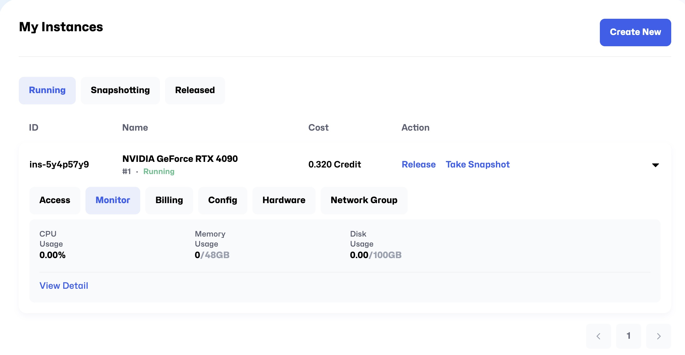
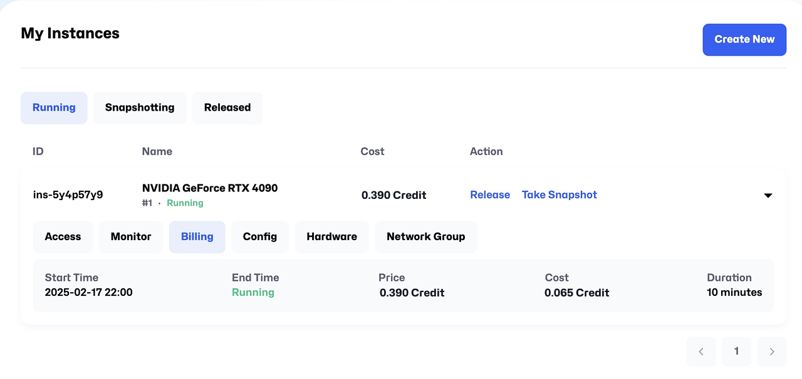
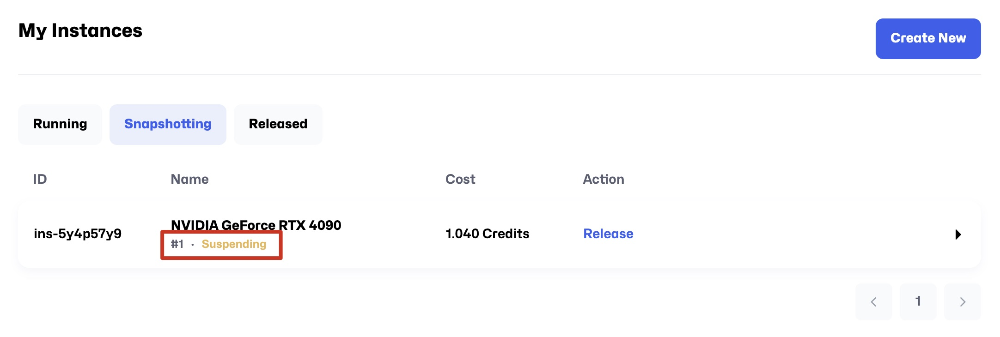
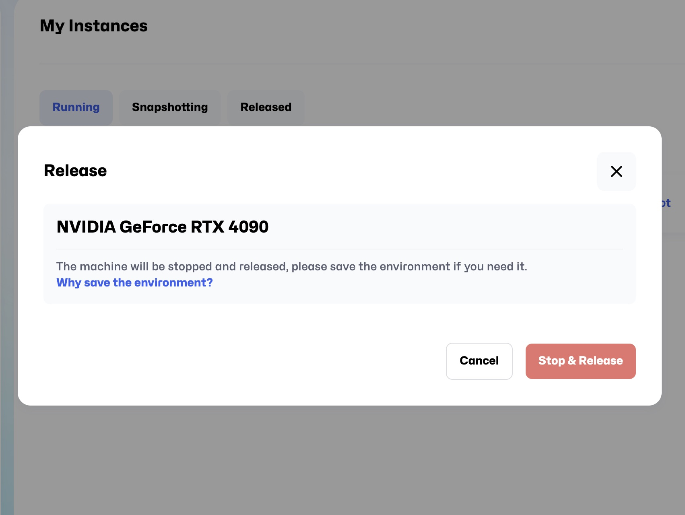

# 管理實例

在 **My Instance** 頁面，您可以查看並管理所有實例的狀態與配置。以下是詳細功能介紹：

---

## **實例狀態**

在 **My Instance** 頁面中，您可以看到三種實例狀態：

1. **Running**：實例正在運行，您可以對其進行訪問或管理操作。⚠️**只有在此狀態下，實例才會產生計費**，請妥善管理使用時間。
2. **Snapshotting**：實例正在執行快照操作，暫時無法進行其他管理操作。此狀態**不會產生額外計費**。
3. **Released**：實例已被釋放，資源已回收，該狀態的實例無法再次啟動，**也不會再計費**。

**每個狀態都有一個實例列表其欄位有**:

- **ID**：每個實例的唯一標識符。
- **Name**：實例名稱，方便用戶辨識。
- **Cost**：當前實例的計費狀態與累積費用。
- **Action**：可對實例進行的操作（詳見下方操作介紹）。

## **選項卡（Tabs）**

點擊實例列表中的其中一列，可以查看對應的實例並管理以下選項卡內容：

### **1. Access**

- **SSH Port 22**

  - 查看用於 SSH 連接的相關資訊：
    - **SSH Command**：`ssh -p <Service Port> root@<Access URL>`
    - **Service Port**：該實例的服務端口。
    - **User**：默認用戶名為 `root`。
    - **Password**：初始密碼（加密顯示）。

- **HTTP Port 8888**
  本端口預設部署的是 JupyterLab 服務，點擊 Open 即可直接訪問實例。

  - 提供以下操作：
    - **Link**：快速跳轉到 HTTP 地址。
    - **Open**：在新標籤頁中打開該連結。
    - **Copy**：複製 HTTP 地址。
    - **Edit**：編輯端口設置（若可用）。
    - **Delete**：刪除該端口的配置。

- **New Port Forwarding**：點擊此按鈕新增端口轉發規則，填入以下資訊：

  - **Service Port**：設定服務端口。
  - **Protocol**：選擇服務協定類型，預設為 TCP。若您要轉發的是 Web 類型服務（如 JupyterLab、Dashboard 等），請勾選 `HTTPS` 來啟用加密訪問（HTTPS），確保瀏覽器連線安全性。

### **2. Monitor**

即時查看實例的效能與資源使用狀況。

### **3. Billing**

顯示與該實例相關的所有計費明細。

### **4. Config**

查看實例的配置，如映像檔相關參數設置。

### **5. Hardware**

檢查實例的硬件配置，包括 GPU 或 CPU 型號、內存、存儲等。

### **6. Network Group**

查看實例的集群網路資訊。Glows.ai 支援多機多卡運行，您可以在 Mesh 中將多個實例加入同一個集群，使集群內的實例透過內網 IP 互相連通，實現更高效的運算協作。

---

## **實例狀態是 Running 時可執行的操作**

在 action 欄位有 `Take Snapshot` 和 `Release` 兩個按鈕

### **1. Take Snapshot**

- **功能**：建立當前實例的快照，保存實例中除 /datadrive 外的所有狀態與檔案變更，包括已安裝的套件、系統設定與其他目錄中的修改內容。
- **使用情境**：
  - 對實例環境進行了較多自定義設定（如安裝 Python 套件、Ubuntu 軟體等），希望保存當前狀態以便下次快速重現。
  - 作為日後建立新實例的基礎模板，避免重複配置。

#### **Take Snapshot 詳細操作流程**

1. **點擊 Action 欄位中 `Take Snapshot` 按鈕，將彈出快照創建窗口。**

2. **填寫快照資訊**：

   - **Name**：填寫快照名稱。
   - **Automatic release of machine after successful saving**：若勾選此選項，快照製作完成後，實例將自動釋放；
     若未勾選，快照完成後實例將自動恢復為 Running 狀態，您可繼續使用該實例。

3. **查看快照進程**：

   - 保存過程中，實例會顯示於 **Snapshotting** 的標籤頁，並依次顯示狀態變化：

     - **Suspending** → **Paused** → 從列表中消失。

     

     

   - 實例保存完成後，不會再出現在 **My Instance** 頁面中，而是存儲為快照，可在 **Snapshots** 頁面中查看。

4. **完成後的影響**：

   - 快照保存過程中，實例將暫停運行，並在保存完成後自動恢復或釋放（取決於是否勾選自動釋放）。

#### **注意事項**

- 保存過程中實例將暫時無法使用，並自動恢復連線後才能再次操作。
- 快照保存需要足夠的個人存儲空間，請提前確認。

---

### **2. Release**

- **功能**：釋放實例資源，並將實例轉為 **Released** 狀態。
- **使用情境**：當您不再需要此實例時，可以選擇釋放來回收資源，停止費用計算。

#### **Release 詳細操作流程**

1. **點擊 Action 欄位中 `Release` 按鈕**，將彈出確認窗口。

2. **確認釋放**：

   - 系統會提示相關注意事項，例如數據刪除與不可恢復性。
   - 點擊 `Stop & Release` 確認釋放操作。

3. **釋放過程的狀態更新**：

   - 實例狀態將變為 **Releasing**，並最終更新為 **Released**。

4. **如何從 Snapshot 啟動新實例：創建實例的時候選擇 Snapshot，然後啟動實例即可。**：

   - 實例快照創建完成後：如果您沒有勾選保存完成後釋放實例，則可在 My Instance 介面中 Running 下看到實例，否則實例將會自動釋放。

   

#### **注意**：快照創建期間，實例不可訪問，實例內運行程序會中斷，一般建議在使用完畢釋放機器之前進行快照創建。

---

## **注意事項總結**

1. **Snapshotting 和 Released 限制**：

   - 在這兩個狀態下，僅能檢視 **Config** 和 **Hardware** 選項卡，無法執行其他操作。

2. **釋放與快照建議**：

   - 在選擇釋放操作前，請務必確認是否需要保留當前數據。
   - 定期創建快照可以幫助保存關鍵數據。

3. **操作影響**：

   - 某些操作（如快照與釋放）可能會中斷實例的正常使用，請合理安排時間進行。

以上是關於實例管理的完整指南，若需要更詳細的說明，請參考後續章節。
