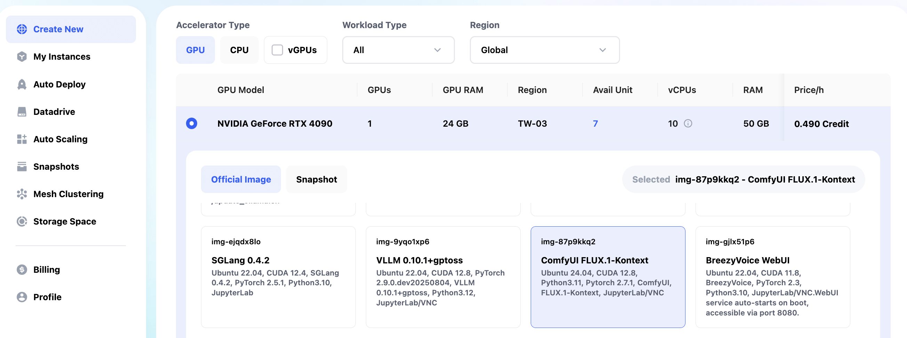
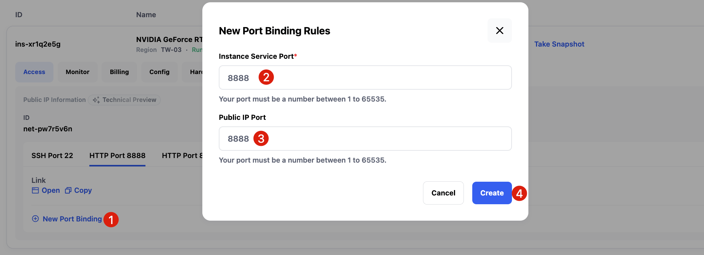
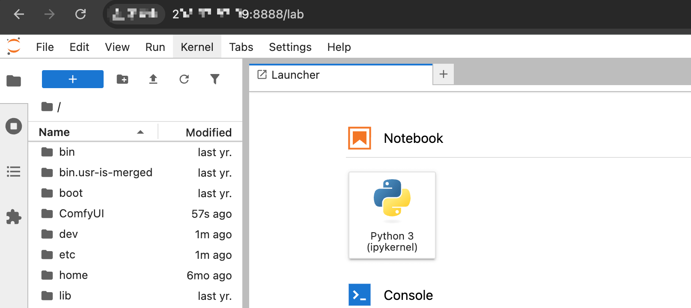
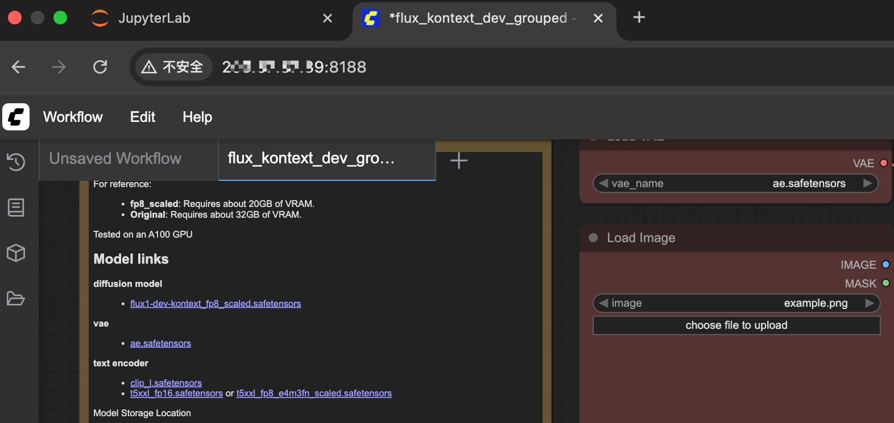
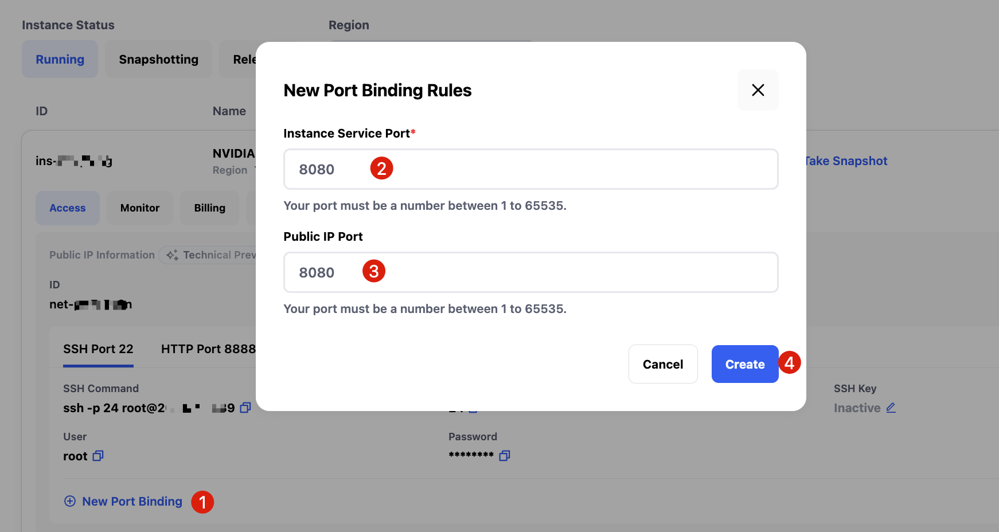

# Bind Public IP 功能使用教學

**Bind Public IP** 是 Glows.ai 最新上線的功能，目前處於內測階段。若您有使用需求，可透過文末聯繫方式申請開通。本文將介紹該功能的使用方法。

---

## 開通後的使用流程

啟用 **Bind Public IP** 功能後，實例的建立流程與以往大致相同，首先選擇需要的鏡像。

與以往不同的是，您可以點擊 **Bind** 按鈕，為實例配置固定 IP。
點擊後，依照介面提示選擇系統分配的固定 IP，並點擊 **Complete Checkout**，即可完成帶有固定 IP 的實例創建。

---

## 查看與修改端口映射

實例建立完成後，介面會自動顯示部分默認服務的訪問鏈接。
但由於默認映射的 HTTP 端口號較低，直接使用瀏覽器訪問時可能會出現「無法加載」的提示（這是因為瀏覽器的安全策略會限制 IP + 低端口號的訪問）。

此時，您可以按照下圖操作，點擊 **New Port Binding**，將實例內的 8888 端口映射到固定 IP 的 8888 端口。

完成映射後，即可透過 `固定IP:8888` 訪問實例內默認啟動的 **JupyterLab** 服務。
其他自建服務的訪問方式也相同。

例如，您可以將 **ComfyUI** 的 8188 端口映射到固定 IP 的 8188 端口，並透過該地址訪問服務。

---

## 新增自定義端口

除了默認服務外，您也可以新增其他端口來部署自建服務。
如下圖，點擊 **New Port Binding**，新增一個 8080 端口，並將其映射到固定 IP 的 8080 端口。

接著，在實例內啟動一個簡單的 HTTP 服務監聽 8080 端口：

當服務啟動後，即可在瀏覽器中透過 `固定IP:8080` 訪問，十分方便。

---

## 綁定自有網域

此外，您也可以將固定 IP 解析到自己的網域，並透過自有網域直接訪問相關服務。

---

## 聯繫我們

如在使用 **Glows.ai** 過程中遇到任何問題或有建議，歡迎透過以下方式聯繫我們：

- **Email**: [support@glows.ai](mailto:support@glows.ai)

- **Line**: [https:/lin.ee/fHcoDgG](https:/lin.ee/fHcoDgG)

- **Discord**: [https://discord.com/invite/glowsai](https://discord.com/invite/glowsai)
